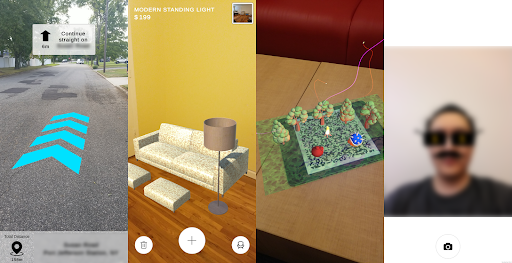

# Erebus Framework & Example Applications

  

## Prerequisites
Please ensure you have the following environments setup with all the dependencies to be able to reproduce the results in the paper. 
We utilized third-party Unity plugins to facilitate the development process. These plugins include open-sourced and closed-sourced. The latter are not included in this repository.

#### Install Packages & Plugins
Development environment : Unity 2020.3.25f1 LTS, Android 13, Samsung Galaxy S22

1. OpenCV for Unity 2.4.7 [[AssetStore](https://assetstore.unity.com/packages/tools/integration/opencv-for-unity-21088)]
2. Roslyn C# - Runtime Compiler [[AssetStore](https://assetstore.unity.com/packages/tools/integration/roslyn-c-runtime-compiler-142753)]
3. NuGet for Unity [[Github](https://github.com/GlitchEnzo/NuGetForUnity)]
4. Antlr4.Runtime.Standard.4.10.1 [[NuGet](https://www.nuget.org/packages/Antlr4.Runtime.Standard/4.10.1)]
5. NetMQ [[Github](https://github.com/zeromq/netmq)]
6. BetterStreamingAssets [[AssetStore](https://assetstore.unity.com/packages/tools/input-management/better-streaming-assets-103788)]
7. NatML [[Github](https://github.com/natmlx/natml-unity)]
8. Unity AR Foundation [[Official documentation](https://docs.unity3d.com/Packages/com.unity.xr.arfoundation@4.2/manual/index.html)]
9. Unity ARCore XR Plugin [[Official documentation](https://docs.unity3d.com/Packages/com.unity.xr.arcore@4.1/manual/)]
\* **The example applications contain the Erebus framework in the Unity projects, whereas the closed-sourced plugins are excluded. They must be imported into the applications manually**

#### Unity Project Configurations
- Android platform
- **MUST** be Mono scripting  (IL2CPP use AOT compilation -> No runtime code compilation)
- .NET 4.0
- Reconfigure 'Company Name,' 'Product Name,' if you download the Unity project file and set Minimum Android API (25) 
- Place the runtime code base/parent class ('BaseAssemblyEntryPoint.cs') under StreamingAssets folder
- Place the default (Placeholder code) erebus language code of the four AR apps and name them, input1.erebus, input2.erebus, input3.erebus, input4.erebus, respectively
- Add runtime library assets (*mscorlib, UnityEngine, UnityEngine.CoreModule, System, System.Core, System.Linq, System.Reflection, Microsoft.CSharp, System.Collections*) using Roslyn Libray Reference Asset Manager and link all the additional MetaAssets to the CodeController.cs of the UI app
- Place all the necessary files of ANTLR Transpiler, C# Converter to the Scripts folder

## Erebus Permission Manager
We developed Erebus framework that enables safeguarding of user privacy in AR systems. The Erebus Permission Manager operates similar to the Settings app in Android system. User has the option to view and modify the permissions of each app as well as define language-like policies. The permission app is the starting point of Erebus framework as it invokes the policy generation, permission management, data save, and loading. 

## Example AR Applications
We release two of the five AR applications we implemented. The **AR Furniture Preview** is an app that displays the preview look of the furnitures in your physical space utilizing the power of AR. It well demonstrates the responsiveness of Erebus while protecting the privacy of the users. The app detects a flat horizontal surface and places the furnitures. Another is **AR Face Filter** app. It detects the face of the user and overlays a sunglass and a mustache. It runs face detection and object detection & segmentation within the Erebus to provide minimal information to the application. The applications contain Erebus Framework.

